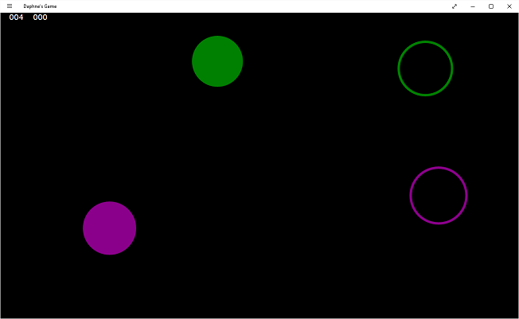

## Daphne's Game

This is a work in progress. It currently runs on Windows 8/8.1/10 as well as Windows Phone 8.1. There is a bug that sometimes causes it to freeze/crash after the initial five levels and there are also some issues with overlapping shapes that can result in an unwinnable level. My daughter enjoys it anyway so I haven't dug in to fix the bugs.

You start with one circle and it progresses with more circles on-screen, as well as squares. Just drag and drop to the right location and you'll trigger a short laser sound to indicate the shape dropped in. Upon completion of the level, a crowd cheers and claps.

## credit

I was inspired by [https://www.microsoft.com/en-us/store/apps/toddler-touch-and-drag/9wzdncrdkdrh](Toddler Touch and Drag) which appears to be abandoned (and does not run on mobile).

## license
Everything here is GPLv3 unless otherwise noted. The source is not currently updated with the license information.